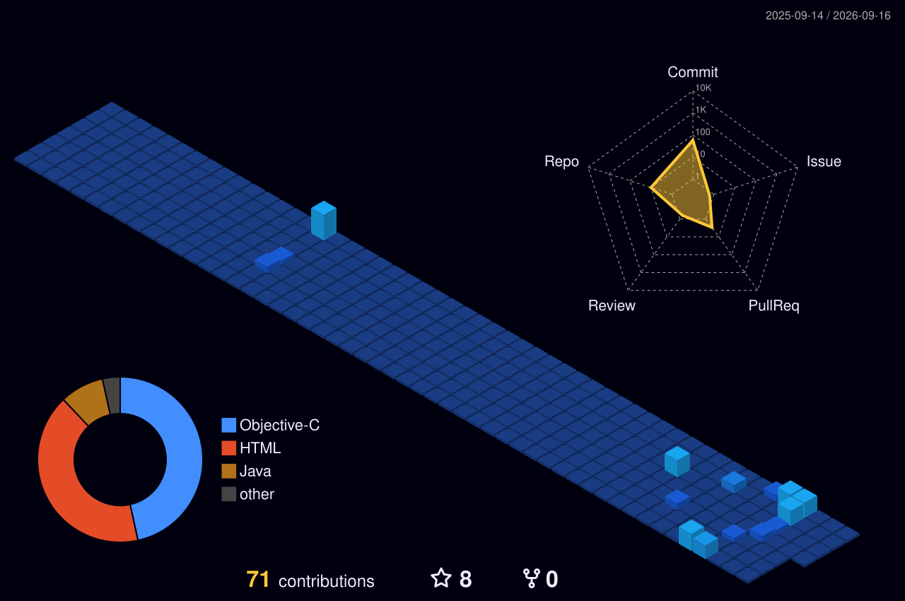
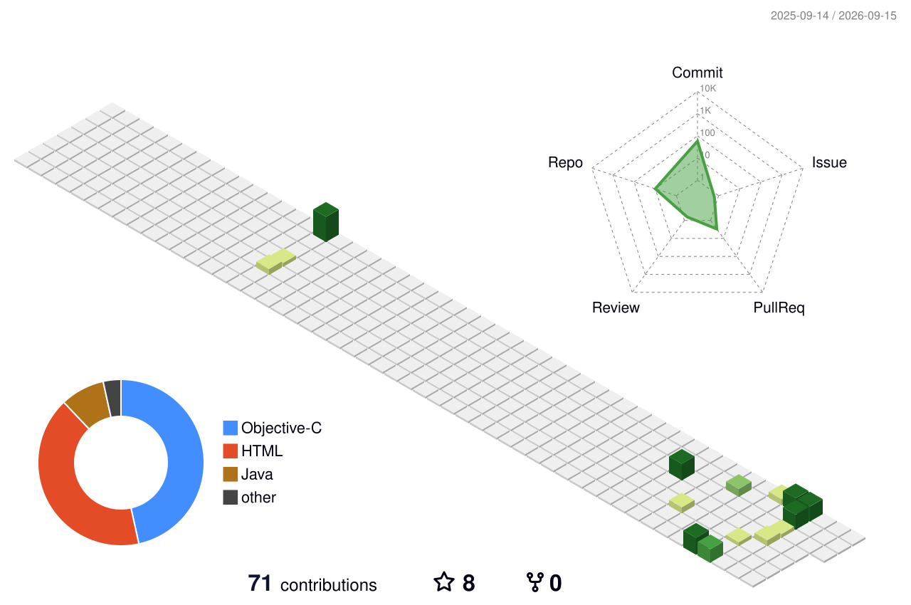
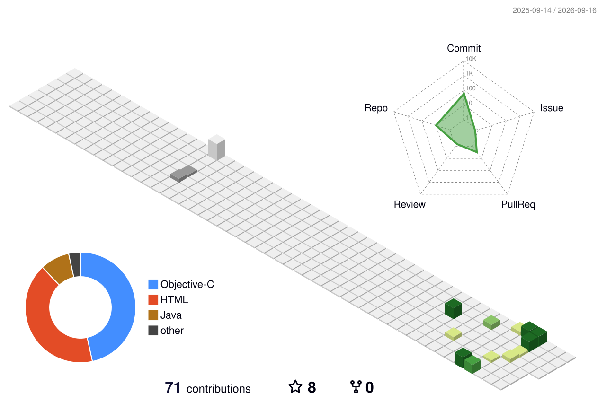
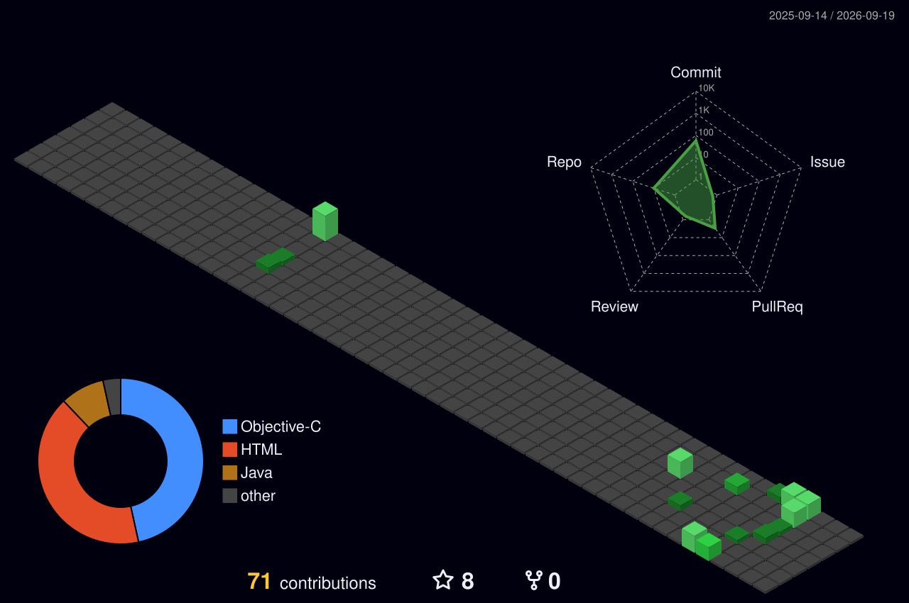
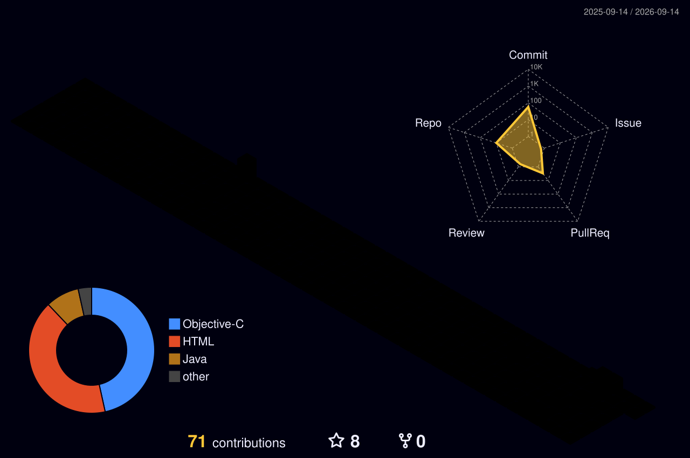
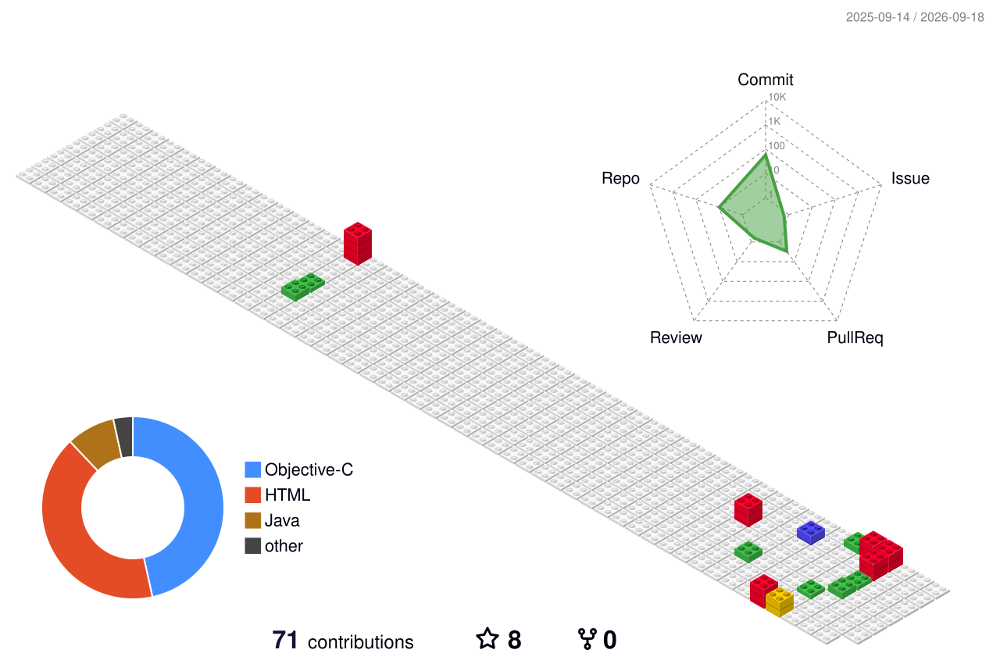

# Erico

### Developer · Builder · Creator

 

Building practical software, developer tools and experiments across Apple platforms and beyond.

  

---

## About

I build software because useful ideas deserve to become working products, not eternal folders called `final_v7_really_final`.

My current interests include Apple-platform development, Swift and SwiftUI, developer tools, Minecraft-related projects, local AI, automation and experiments that probably started with “this should be easy”.

---

## Tech Stack

---

## Featured Projects

### PocketJ Launcher

Apple-native Minecraft: Java Edition launcher for iPhone and iPad, with a redesigned interface, instance management, diagnostics and modern iOS compatibility work.

### MC Server Dashboard

A Minecraft Java / Fabric server administration project focused on permissions, player management, world controls and server-side security tools.

---

## GitHub Activity

---

## Contribution Snake

<picture>
  <source media="(prefers-color-scheme: dark)" srcset="https://raw.githubusercontent.com/EricoEC/EricoEC/output/github-snake-dark.svg">
  <source media="(prefers-color-scheme: light)" srcset="https://raw.githubusercontent.com/EricoEC/EricoEC/output/github-snake.svg">
  
</picture>

---

## 3D Contribution City

<b>More 3D contribution styles</b>

 

### Animated Green

### Seasonal Animated

### Night Green

### Night Rainbow

### Git Block

---

### Build things worth keeping.

Less decoration. More working software.

<!--
**EricoEC/EricoEC** is a ✨ _special_ ✨ repository because its `README.md` (this file) appears on your GitHub profile.

Here are some ideas to get you started:

- 🔭 I’m currently working on ...
- 🌱 I’m currently learning ...
- 👯 I’m looking to collaborate on ...
- 🤔 I’m looking for help with ...
- 💬 Ask me about ...
- 📫 How to reach me: ...
- 😄 Pronouns: ...
- ⚡ Fun fact: ...
-->
